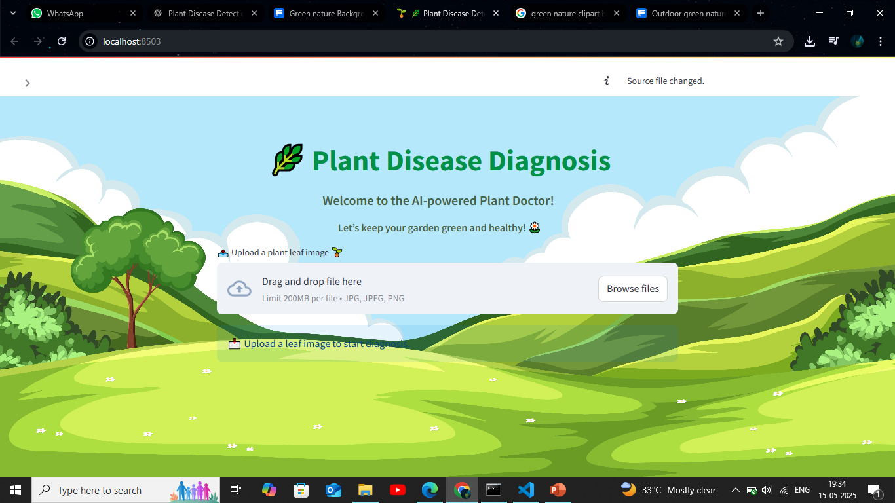
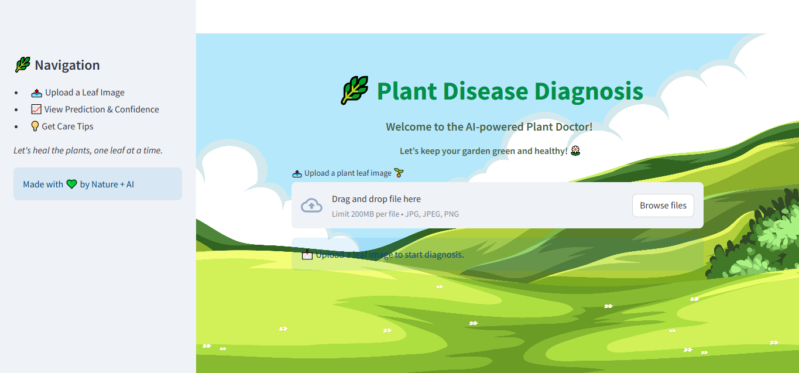
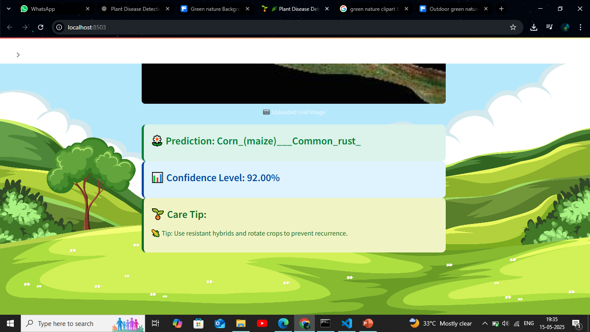

# 🌿 Plant Disease Detection using Deep Learning
The Plant Disease Detection System leverages deep learning and computer vision techniques to identify diseases in plant leaves from images.
<div align="center">
  
</div>

## 🧪 Overview
This is an AI-powered web application that helps identify **plant leaf diseases** from images using a **TensorFlow deep learning model**. Users can upload an image of a leaf, and the model predicts the disease class along with confidence and personalized plant care tips.
> Built with **Streamlit**, **TensorFlow**, and love for plants 🌱

## 🚀 Features

- 🔍 **Image-based Disease Classification** using a trained CNN model
- 📸 Upload any leaf image (JPG/PNG)
- 📊 Displays **prediction**, **confidence level**, and **plant care tips**
- 🌄 Custom **background UI** for an attractive look
- ✅ Supports multiple plant types (e.g., Apple, Corn, Grape, etc.)

  ## 🖼️ App Preview



## 📁 Project Structure
```
waste-classification-app/
├── pdd_app.py                    # Streamlit application file
├── best_model.keras              # Trained classification model
├── images/
│   └── app_preview.png           # Screenshot of the app interface
├── plant_disease_detection.ipynb # Jupyter notebook for model training and evaluation
├── requirements.txt              # Project dependencies
└── README.md                     # Project overview and instructions
```
## ⚠️ Note
- The machine learning model (best_model.keras) is not included in this repository due to GitHub's file size limitations.
- To use the app, you can train your own model or request the file separately.

## 🧠 Model Details
- Model Type: Convolutional Neural Network (CNN)
- Framework: TensorFlow / Keras
- Input size: 224x224
- Trained on: Augmented dataset of plant leaf images (10+ classes)

## 🧩 Sample Plant Classes
- Apple: Apple scab, Black rot, Cedar apple rust, Healthy
- Corn: Common rust, Northern Leaf Blight, Healthy
- Grape: Black rot, Healthy

## 📜 License
This project is open-source and free to use for educational and non-commercial purposes.

## 🤝 Contributing
Feel free to fork the project, create feature branches, and submit pull requests.
